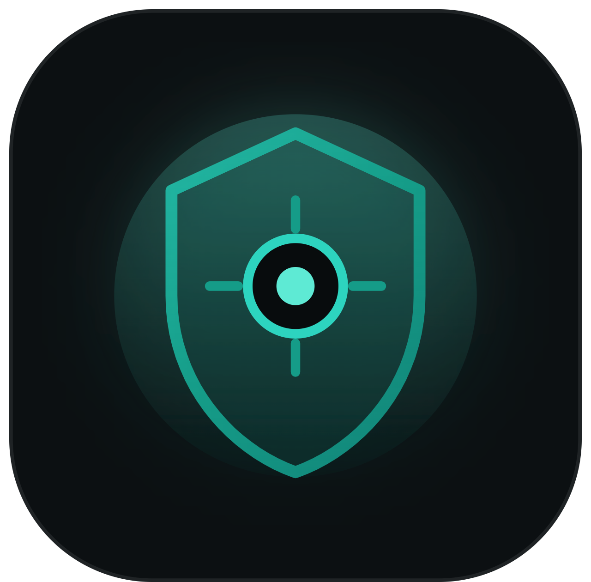

<div align="center">
  
  <h1>Bit Protector</h1>
  <p><strong>100% Client-Side In-Browser Metadata Privacy & File Sanitization Engine</strong></p>
  <p>Zero Server Uploads • Zero Telemetry • 100% Volatile Memory Execution</p>
</div>

---

## 🛡️ Overview

**Bit Protector** is a zero-knowledge, browser-based metadata privacy and deep file cleaning engine. It allows users, journalists, activists, and security professionals to inspect, selectively strip, and sanitize embedded tracking properties (GPS coordinates, author names, camera serial numbers, editing history, and revision tracks) entirely inside local browser memory.

No files, filenames, byte offsets, or telemetry ever leave your device.

---

## ⚡ Architecture Flow

```text
┌───────────────────────────┐
│     User Drops File       │ (.jpg, .png, .webp, .pdf, .docx, .xlsx, .pptx)
└─────────────┬─────────────┘
              │
              ▼
┌───────────────────────────┐
│   Volatile ArrayBuffer    │ (Loaded in client memory, zero network I/O)
└─────────────┬─────────────┘
              │
              ▼
┌───────────────────────────┐
│   Dual Extractor Engine   │ (Parses EXIF, GPS, XMP, XML Core/App Properties)
└─────────────┬─────────────┘
              │
              ▼
┌───────────────────────────┐
│   Sanitization Engine     │ (Pristine Canvas Re-encoding, PDF /Info & XMP
└─────────────┬─────────────┘  Purging, OpenXML Blank Shell Replacement)
              │
              ▼
┌───────────────────────────┐
│   Local Clean Download    │ ([original_name]_cleaned.[ext])
└───────────────────────────┘
```

---

## ✨ Key Features

- **100% In-Browser Execution**: Uses HTML5 Canvas, `pdf-lib`, `jszip`, and Web APIs for binary parsing. No backend server, cloud functions, or external APIs.
- **Zero Bluff / Honest Privacy Verdicts**: Single-line risk rating (HIGH / MEDIUM / LOW) based on actual detected coordinates and identity markers.
- **Selective & Master Sanitization**: Choose which categories to strip (GPS, Camera/Device, Author/Workstation, Timestamps) or execute a master one-click scrub.
- **True Lossless Re-encoding**: Visual resolution and document layout are preserved.
- **Re-Upload Verification**: Re-uploading any sanitized file confirms **0 detected metadata fields** and a `Risk: LOW (Clean)` verdict.

---

## 📁 Supported File Formats

| Format | Extension | Metadata Parsed & Sanitized |
| :--- | :--- | :--- |
| **JPEG** | `.jpg`, `.jpeg` | EXIF IFD0/Exif/GPS, WGS-84 coordinates, camera serials, lens profile, software, IPTC/Photoshop APP13, timestamps |
| **PNG** | `.png` | Ancillary chunks (`eXIf`, `tEXt`, `zTXt`, `iTXt`), author notes, software tags |
| **WebP** | `.webp` | RIFF container `EXIF` and `XMP ` chunks |
| **PDF** | `.pdf` | `/Info` dictionary (`/Author`, `/Title`, `/Subject`, `/Creator`, `/Producer`, dates), `/Metadata` XMP streams, page `/Thumb` caches |
| **Word** | `.docx` | `docProps/core.xml` (`<dc:creator>`, `<cp:lastModifiedBy>`, `<cp:revision>`), `docProps/app.xml` (`<Company>`, `<TotalTime>`), inline comments & track changes |
| **Excel** | `.xlsx` | Document properties, organization signatures, cell comments & author tags |
| **PowerPoint** | `.pptx` | Presentation properties, slide notes, reviewer markup, thumbnail caches |

---

## 🚀 Quick Start

### Prerequisites
- Node.js (v18+ recommended)
- npm or pnpm or yarn

### Installation & Local Development

```bash
# Clone the repository
git clone https://github.com/your-username/bit-protector.git
cd bit-protector

# Install dependencies
npm install

# Start local dev server
npm run dev
```

Visit `http://localhost:3000/` in your browser.

### Production Build

```bash
# Type check and build optimized bundle
npm run build

# Preview production build locally
npm run preview
```

---

## 🧪 Security & Verification Testing

Run the automated integration test suite to verify extraction and sanitization across JPEG, PDF, and DOCX files:

```bash
node scripts/test-verification.mjs
```

Expected output:
```text
=== BIT PROTECTOR COMPREHENSIVE VERIFICATION TEST ===

1. JPEG: Extraction & Selective Sanitization
  ✓ PASS: JPEG Camera Make extracted accurately ("Apple")
  ✓ PASS: JPEG Camera Model extracted accurately ("iPhone 13 Pro")
  ✓ PASS: JPEG GPS Latitude extracted accurately (37.7749°)
  ✓ PASS: Selective: GPS successfully stripped
  ✓ PASS: Selective: Camera Model preserved

2. PDF: Extraction & Sanitization
  ✓ PASS: PDF author extracted ("John Doe")

3. DOCX: Extraction & Sanitization
  ✓ PASS: DOCX author extracted ("Jane Smith")

=== SUMMARY: 7/7 TESTS PASSED ===
```

---

## 🔒 Threat Boundary Disclaimer

> **Disclaimer:** Metadata removal only sanitizes internal file properties (GPS coordinates, camera identifiers, author names, editing timestamps). It does not alter your external network IP address, server logs, ISP routing records, or external web trails. Always verify output files before transmitting over hostile network environments.

---

## 📄 License

This project is open-source software licensed under the [MIT License](LICENSE).
